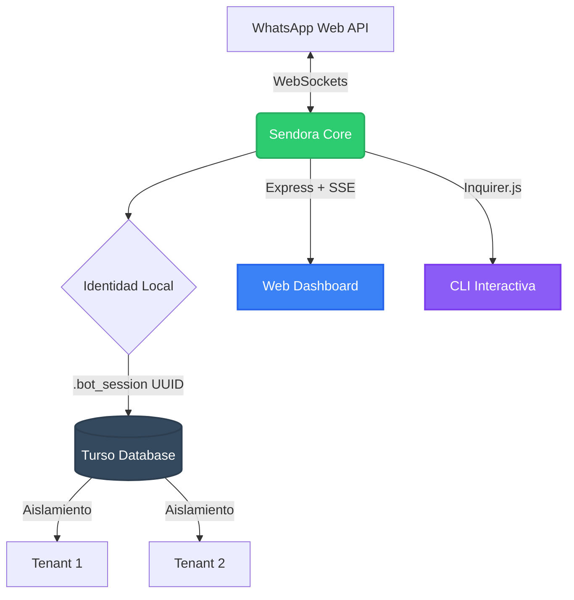

<div align="center">
  <h1>🤖 Sendora (WhatsApp Automation)</h1>
  <p><strong>Un bot de WhatsApp automatizado, multi-tenant y 100% stateless diseñado para escalar.</strong></p>
  
  [](https://nodejs.org/)
  [](https://www.typescriptlang.org/)
  [](https://github.com/WhiskeySockets/Baileys)
  [-black.svg)](https://turso.tech/)
</div>

---

## 📖 Introducción

Sendora es una herramienta de automatización para WhatsApp construida sobre la potente librería **Baileys**. Su arquitectura está diseñada para resolver los problemas críticos comunes de los bots de WhatsApp: pérdida de sesiones por reinicios, consumo de recursos locales masivos y colisiones en servidores compartidos.

Gracias a la integración con **Turso (libSQL)**, Sendora opera con una arquitectura **Stateless y Multi-Tenant**, permitiendo que múltiples instancias o clientes compartan el mismo backend de base de datos de manera completamente aislada y sin requerir persistencia de archivos locales.

## ✨ Características Principales

- **☁️ 100% Stateless**: Todo el estado criptográfico de WhatsApp, contactos, canales e historial de configuraciones se guarda cifrado y distribuido en Turso.
- **🖥️ Dual-Mode (CLI & Web UI)**: Usá el bot desde una **CLI interactiva** en la terminal, o cambiá al **Dashboard Web Premium** (Express + SSE) para autenticación en tiempo real (QR / Pairing Code), envío de mensajes y gestión completa desde el navegador.
- **🏢 Arquitectura Multi-Tenant**: Cada instalación genera un `.bot_session` único. Podés tener cientos de bots corriendo en el mismo servidor o base de datos sin colisión de datos.
- **⚡ Sincronización en Tiempo Real**: Contactos, canales y grupos se sincronizan automáticamente al conectar. Los listeners se registran **antes** de que la conexión abra (patrón `onSocketCreated`) para capturar el evento `messaging-history.set` que Baileys dispara durante el handshake.
- **🚀 Ultra Baja Latencia**: Optimizado al milisegundo. Caché en memoria para claves criptográficas Signal, agrupamiento de consultas N+1 (IN queries), debounce de I/O, caché TTL para API de grupos y versión de Baileys, y streaming inteligente de archivos.
- **📦 Envíos Mixtos (Multi-archivo)**: Soporta enviar a la vez textos, múltiples imágenes, videos y documentos en un solo flujo, adaptándose inteligentemente a las restricciones anti-spam de WhatsApp.
- **📅 Programador Avanzado (Cron)**: Sistema interno robusto para programar envíos recurrentes a contactos, grupos y canales (newsletters).
- **🛡️ Interfaz Limpia**: CLI interactiva impulsada por `@inquirer/prompts` libre de logs basura o JSONs confusos.

## 🏗️ Arquitectura



## ⚡ Optimizaciones de Rendimiento

Sendora implementa un pipeline de optimización extrema para garantizar la menor latencia posible:

| Componente | Optimización | Impacto |
|---|---|---|
| **Auth State** | Caché write-through en memoria para todas las claves Signal. Pre-carga bulk al iniciar, lecturas a 0ms. | Elimina ~150ms por operación criptográfica |
| **Groups API** | Caché con TTL de 5 minutos para `groupFetchAllParticipating()` | Evita saturar la API de WhatsApp |
| **Sender** | Delays configurables (800ms inter-archivo, 1500ms rate-limit). Streaming para archivos >10MB. | 47% más rápido en envíos multi-archivo |
| **Schema** | Versionado de migraciones. Skip automático si la DB está actualizada. | Arranque instantáneo en ejecuciones posteriores |
| **Credentials** | Debounce de 500ms en `saveCreds` | Reduce writes a Turso durante handshakes |
| **Baileys Version** | Caché de versión con TTL de 1 hora | Evita HTTP a GitHub en reconexiones |
| **Contact Sync** | Listeners pre-conexión via `onSocketCreated` callback | Captura 100% de eventos de historial |

## 🌐 Web Dashboard

El Dashboard Web ofrece una interfaz premium con tema oscuro y glassmorphism:

- **Autenticación visual**: Escaneá el QR directamente desde el navegador o usá Pairing Code.
- **Detección automática de sesión**: Si ya estás autenticado, el dashboard conecta automáticamente al bot.
- **SSE en tiempo real**: Los estados de conexión (QR, connecting, connected) se transmiten vía Server-Sent Events sin polling.
- **Envío de mensajes**: Seleccioná un destinatario, escribí tu mensaje, adjuntá archivos y enviá desde la UI.

## 📦 Instalación

1. Cloná este repositorio:
```bash
git clone https://github.com/TecTroncoso/Sendora.git
cd Sendora
```

2. Instalá las dependencias:
```bash
npm install
```

3. Configurá el entorno:
Copiá el archivo de ejemplo y renombralo a `.env`. Completá las credenciales de tu base de datos Turso.
```env
TURSO_DATABASE_URL=libsql://tu-base-de-datos.turso.io
TURSO_AUTH_TOKEN=tu_token_secreto
```

## 🚀 Uso Rápido

Iniciá el entorno en modo desarrollo:

```bash
npm run dev
```

El sistema te va a preguntar qué interfaz preferís:

### 🖥️ Terminal (CLI)
1. **Autenticación**: Elegí entre **Código QR** o **Pairing Code**.
2. **Gestión Interactiva**: Una vez conectado, usá las flechas del teclado para:
   - 📇 Sincronizar y listar contactos/canales.
   - 📝 Programar contenido automático (Cron jobs).
   - 📤 Enviar mensajes manuales de prueba.
   - 📊 Consultar el historial de envíos.

### 🌐 Web Dashboard
1. Se levanta en `http://localhost:3000`.
2. Si ya tenés sesión guardada, conecta automáticamente.
3. Si no, elegí tu método de autenticación y escaneá el QR desde el navegador.

### 🔧 Comandos Útiles

```bash
# Desarrollo
npm run dev

# Compilar para producción
npm run build

# Ejecutar compilado
npm start

# Resetear autenticación (si hay corrupción de sesión)
npx tsx reset_auth.ts
```

> [!WARNING]
> **Archivos Sensibles**: Nunca expongas tu archivo `.bot_session` ni tu `.env` a repositorios públicos. El identificador de sesión es la llave maestra para recuperar tus datos de la base de datos distribuida. Si mudás el bot a un servidor de producción (AWS, Railway, Render, etc.), asegurate de inyectar tu `.bot_session` como variable o archivo secreto.

## 📁 Estructura del Proyecto

```
src/
├── config/
│   ├── env.ts          # Variables de entorno y delays configurables
│   └── session.ts      # Generación y persistencia de .bot_session
├── db/
│   ├── client.ts       # Singleton de conexión a Turso
│   ├── schema.ts       # Migraciones versionadas
│   └── repository.ts   # Queries para targets, contenido y logs
├── whatsapp/
│   ├── authState.ts    # Auth state con caché in-memory write-through
│   ├── connection.ts   # Conexión Baileys + caché de versión + onSocketCreated
│   ├── contacts.ts     # Sync de contactos (pre-conexión) con debounce
│   ├── channels.ts     # Sync de canales/newsletters
│   ├── groups.ts       # Groups con caché TTL 5min
│   └── sender.ts       # Envío inteligente con streaming
├── scheduler/
│   └── cron.ts         # Motor de cron jobs
├── cli/
│   ├── menu.ts         # Menú principal interactivo
│   ├── list-targets.ts # Listado y selección de destinos
│   ├── manual-send.ts  # Envío manual desde CLI
│   ├── schedule-content.ts # Programación de contenido
│   └── logs.ts         # Visualización de historial
├── web/
│   └── server.ts       # Express + SSE para Dashboard
└── index.ts            # Entry point dual-mode
public/
├── index.html          # Dashboard HTML
├── styles.css          # Tema oscuro + glassmorphism
└── app.js              # Lógica del frontend
```

## 🛠️ Stack Tecnológico

- [Node.js](https://nodejs.org/) & [TypeScript](https://www.typescriptlang.org/)
- [Baileys](https://github.com/WhiskeySockets/Baileys) (WhiskeySockets)
- [Turso DB](https://turso.tech/) (libSQL)
- [Express](https://expressjs.com/) + SSE (Server-Sent Events)
- [Inquirer.js](https://github.com/SBoudrias/Inquirer.js/)
- [node-cron](https://github.com/node-cron/node-cron)

## 📄 Licencia

Este proyecto está distribuido bajo la licencia **ISC**.
