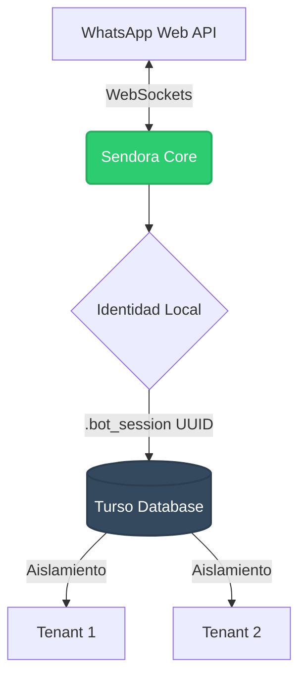

<div align="center">
  <h1>🤖 Sendora (WhatsApp Automation)</h1>
  <p><strong>Un bot de WhatsApp automatizado, multi-tenant y 100% stateless diseñado para escalar.</strong></p>
  
  [](https://nodejs.org/)
  [](https://www.typescriptlang.org/)
  [](https://github.com/WhiskeySockets/Baileys)
  [-black.svg)](https://turso.tech/)
</div>

---

## 📖 Introducción

Sendora es una herramienta de automatización para WhatsApp construida sobre la potente librería **Baileys**. Su arquitectura está diseñada para resolver los problemas críticos comunes de los bots de WhatsApp: pérdida de sesiones por reinicios, consumo de recursos locales masivos y colisiones en servidores compartidos.

Gracias a la integración con **Turso (libSQL)**, Sendora opera con una arquitectura **Stateless y Multi-Tenant**, permitiendo que múltiples instancias o clientes compartan el mismo backend de base de datos de manera completamente aislada y sin requerir persistencia de archivos locales.

## ✨ Características Principales

- **☁️ 100% Stateless**: Todo el estado criptográfico de WhatsApp, contactos, canales e historial de configuraciones se guarda cifrado y distribuido en Turso.
- **🏢 Arquitectura Multi-Tenant**: Cada instalación genera un `.bot_session` único. Puedes tener cientos de bots corriendo en el mismo servidor o base de datos sin colisión de datos.
- **🚀 Ultra Baja Latencia**: Optimizado al milisegundo. Bypass de historial antiguo, debounce de I/O en base de datos y reducción de huella de red (`syncFullHistory: false`).
- **📅 Programador Avanzado (Cron)**: Sistema interno robusto para programar envíos recurrentes a contactos, grupos y canales (newsletters).
- **🛡️ Interfaz Limpia**: CLI interactiva impulsada por `@inquirer/prompts` libre de logs basura o JSONs confusos.

## 🏗️ Arquitectura de Datos



## 📦 Instalación

1. Clona este repositorio:
```bash
git clone https://github.com/TecTroncoso/Sendora.git
cd Sendora
```

2. Instala las dependencias:
```bash
npm install
```

3. Configura el entorno:
Copia el archivo de ejemplo y renómbralo a `.env`. Completa las credenciales de tu base de datos Turso.
```env
TURSO_DATABASE_URL=libsql://tu-base-de-datos.turso.io
TURSO_AUTH_TOKEN=tu_token_secreto
```

## 🚀 Uso Rápido

Inicia el entorno en modo desarrollo:

```bash
npm run dev
```

1. **Autenticación**: El sistema generará automáticamente tu `.bot_session` y te pedirá escanear un **Código QR** o usar un **Pairing Code**.
2. **Gestión Interactiva**: Una vez conectado, usa las flechas del teclado en la consola para:
   - 📇 Sincronizar y listar contactos/canales.
   - 📝 Programar contenido automático (Cron jobs).
   - 📤 Enviar mensajes manuales de prueba.

> [!WARNING]
> **Archivos Sensibles**: Nunca expongas tu archivo `.bot_session` ni tu `.env` a repositorios públicos. El identificador de sesión es la llave maestra para recuperar tus datos de la base de datos distribuida. Si mudas el bot a un servidor de producción (AWS, Railway, Render, etc.), asegúrate de inyectar tu `.bot_session` como variable o archivo secreto.

## 🛠️ Stack Tecnológico
- [Node.js](https://nodejs.org/) & [TypeScript](https://www.typescriptlang.org/)
- [Baileys](https://github.com/WhiskeySockets/Baileys) (WhiskeySockets)
- [Turso DB](https://turso.tech/) (libSQL)
- [Inquirer.js](https://github.com/SBoudrias/Inquirer.js/)
- [node-cron](https://github.com/node-cron/node-cron)

## 📄 Licencia

Este proyecto está distribuido bajo la licencia **ISC**.
